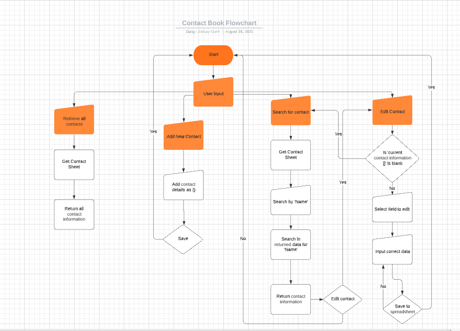
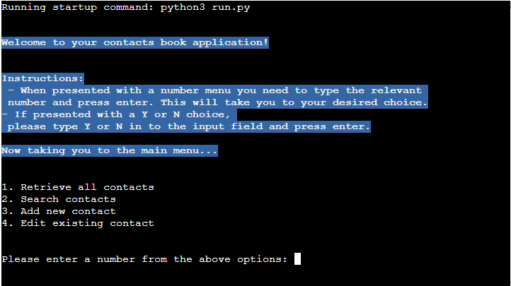
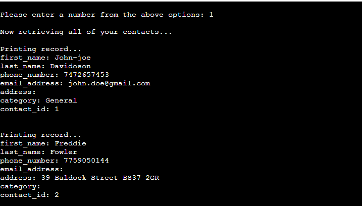
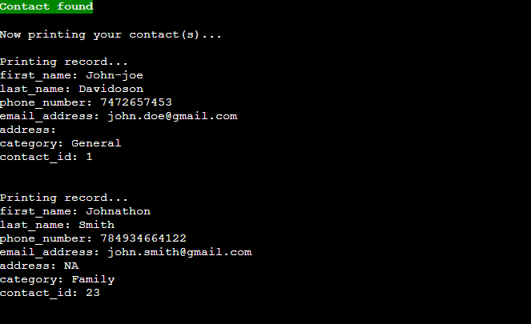
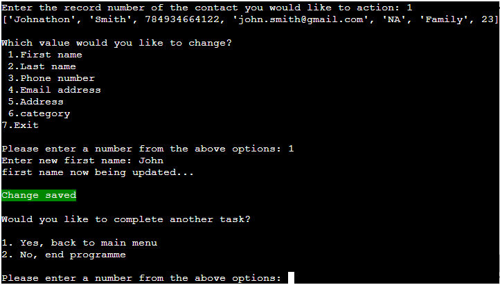
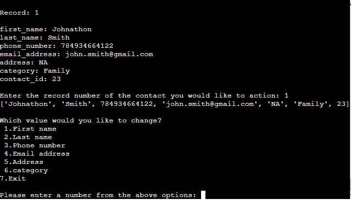
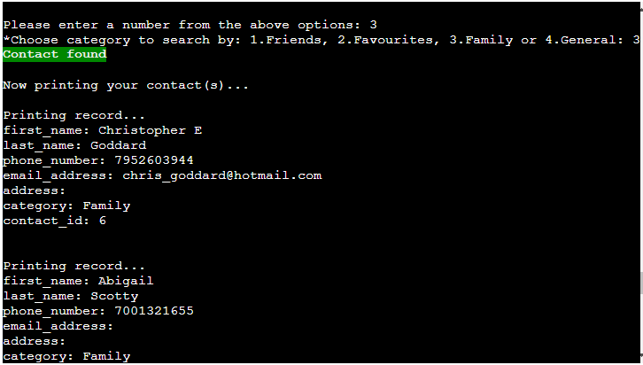
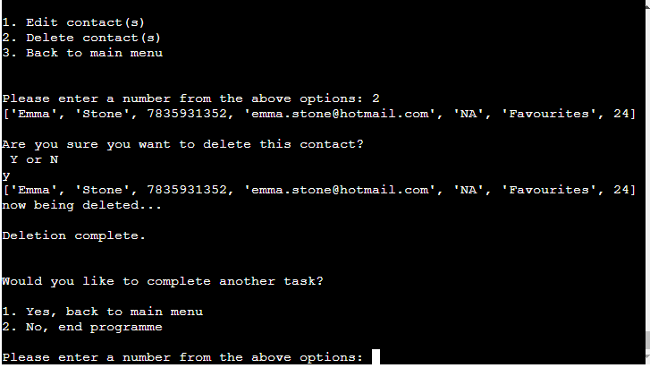
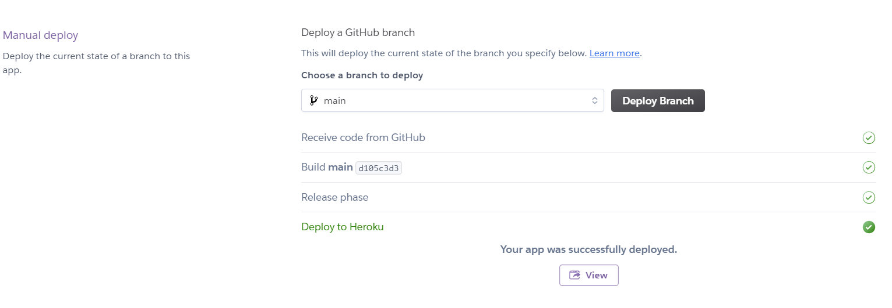

# My Contact Book
---

[Live application can be found here](https://my-contact-book-dgunn.herokuapp.com/)

This is a command-line-interface application designed for a user to access their contacts book, retrieve specific contact information, edit/delete exisiting contacts & add new contact information. This project has been designed for educational purposes and uses the Code Insitutues mock terminal to run.

## UX
To begin planning this project I started first with UX, designing the logic of the programme based upon the user stories. As this is a command-line application there is no design featured as HTML & CSS have not been used; however I made the decision to use the Colored module so that I could add colour to some of the statements printed to the terminal. I chose to do this to provide visual ques for some of the messages, for example a green background for a *Save Complete* message.

### Strategy
User Stories:
- As a user, I want to be able to easily access all of my contacts at once.
- As a user, I want to be able to retrieve a contact's information based upon their name.
- As a user, I want to add new contact information.
- As a user, I want to update an existing contact's information if there has been a change.
- As a user, I want to be able to download contact information by group (family/friends).
- As a user, I want to be able to delete a contact entry.

### Structure

As you can see from the flowchart above the logic has been based around the four key user options, retrieving contacts, adding contacts & editing existing contacts. Each path will take the user back to the beginning once finished. 

---
## Features
The features included in this programme are listed in the main menu and they can be seen below:

Retrieve all contacts:
- From the main menu there is an option to Retrieve All Contacts, once the user has selected this all of the contacts will be printed to the terminal.

Search contacts:
- From the main menu there is an option to Search Contacts, once the user has selected this they are taken to another menu where they can choose what they would like to search by. 
    - First name
    - Last name
    - Category
    - Phone number
- Once the user has selected the field to search by & input the name/number/catergory, if there is a match this will be printed to the terminal.

Add new contact:
- From the main menu there is an option to Add New Contact.
- Once the user has selected this option they are then asked to input a value for: First Name, Last Name, Phone Number, Email, Address, Category. 
- Both names, phone number and category are required entries, the user can input NA for those not required.
- Once all fields have been entered the contact is saved.
- The contact details are printed the terminal and the user is asked if they want to edit the information.
- If they do they will be taken to edit the contact, otherwise they can go back to the main menu.

Edit existing contact:
- From the main menu there is an option to Edit Existing Contact, once the user has selected this they will first be taken to search for the contact they would like edit.
- After the contact has been found they will have the option to edit by typing Y/N
- If they select Y they will then be able to choose which field of the contacts they would like to edit. 
- They input the new information and save.
- The worksheet is updated with the new contact information.

---
## Technologies Useds

I have used several technologies that have enabled this design to work:

- [Python](https://www.python.org/)
    - Python is the core programming language used to write all of the code in this application to make it fully functional.
    - In addition to core Python I have used the following Python modules:
        - [Gspread](https://docs.gspread.org/en/latest/)
            - Used to access my google sheets document throughout the application, to access and edit data.
        - [Google Auth](https://google-auth.readthedocs.io/en/master/)
            - Used to provide access to the application to interact with my google sheet.
        - [pyinputplus](https://pyinputplus.readthedocs.io/en/latest/)
            - Used to validate all of the user inputs.
        - [Colored](https://pypi.org/project/colored/)
        - Used to add colours to the printed terminal messages
- [GitHub](https://github.com/)
    - Used to store code for the project after being pushed.
- [Git](https://git-scm.com/)
    - Used for version control by utilising the Gitpod terminal to commit to Git and Push to GitHub.
- [Gitpod](https://www.gitpod.io/)
    - Used as the development environment.
- [Heroku](https://dashboard.heroku.com/apps)
    - Used to deploy my application.
- [Lucid](https://lucid.app/documents#/dashboard)
    - Used to create the flowchart for the project.
- [Grammarly](https://www.grammarly.com/)
    - Used to fix the thousands of grammar errors across the project.
- [Google Sheets](https://www.google.co.uk/sheets/about/)
    - Used to store the 'Contacts' data used for the application.
---
## Testing

### User Stories
*'As a user, I want to be able to easily access all of my contacts at once.'*  
This is one of the choices from the main menu, if the user selects option 1 all of their contacts are printed to the terminal.

*'As a user, I want to be able to retrieve a contact's information based upon their name or number.'*  
This is one of the choices from the main menu, if the user selects option 2, they are taken to search their contacts by either name/number/category. If there is a match found it is printed to the terminal. 

*'As a user, I want to add new contact information.'*  
This is one of the choices from the main menu, if the user selects option 3, they are taken to add a new contact. The user is asked to input a value for: First Name, Last Name, Phone Number, Email, Address, Category. 

*'As a user, I want to update an existing contact's information if there has been a change.'*  
This is one of the choices from the main menu, if the user selects option 4, they are taken to search their contacts by either name/number/category. If there is a match found it is printed to the terminal. 

*'As a user, I want to be able to download contact information by group (family/friends).'*    
This is one of the choices from the main menu, if the user selects option 2, they are taken to search their contacts by either name/number/category. After the user chooses to search by category they will be asked which category to search by 1.Friends, 2.Favourites, 3.Family or 4.General. All contacts with the relevant category will be printed to the terminal.

*'As a user, I want to be able to delete a contact entry.'*  
After searching for a contact the user will be given the option to delete it, if they choose this option the contact is deleted from the worksheet.

---
## Deployment

The master branch of this repository has been used for the deployed version of this application.

### Using Github & Gitpod

In order to deploy my commnand-line-interface application I had to use the [Code Institute Python Essentials Template](https://github.com/Code-Institute-Org/python-essentials-template), as this enables the application to be properly viewed on Heroku using a mock terminal. 

- Click the `Use This Template` button.
- Add a repository name and brief description.
- Click the `Create Repository from Template` to create your repository.
- To create a gitpod workspace you then need to click `Gitpod`, this can take a few minutes.
- When you want to work on the project it is best to open the workspace from Gitpod (rather than Github) as this will open your previous workspace rather than creating a new one. You should pin the workspace so that it isn't deleted.
-  Commiting your work should be done often and should have clear/explanatory messages, use the following commands to make your commits:
    - `git add .`: adds all modified files to a staging area
    - `git commit -m "A message explaining your commit"`: commits all changes to a local repository.
    - `git push`: pushes all your commited changes to your Github repository.

*Forking the GitHub Repository*

If you want to make changes to your repository without affecting it, you can make a copy of it by 'Forking' it. This ensures your original repository remains unchanged.

1. Find the relevant GitHub repository
2. In the top right corner of the page, click the Fork button (under your account)
3. Your repository has now been 'Forked' and you have a copy to work on

*Cloning the GitHub Repository*

Cloning your repository will allow you to download a local version of the repository to be worked on. Cloning can also be a great way to backup your work.

1. Find the relevant GitHub repository
2. Press the arrow on the Code button
3. Copy the link that is shown in the drop-down
4. Now open Gitpod & select the directory location where you would like the clone created
5. In the terminal type 'git clone' & then paste the link you copied in GitHub
6. Press enter and your local clone will be created.

### Creating an Application with Heroku

I followed the below steps using the Code Institute tutorial:

- The following command in the Gitpod CLI will create the relevant files needed for Heroku to install your project dependencies `pip3 freeze --local > requirements.txt`. Please note this file should be added to a .gitignore file to prevent the file from being commited.

1. Go to [Heroku.com](https://dashboard.heroku.com/apps) and login; if you do not already have an account then you will need to create one.
2. Click the `New` dropdown and select `Create New App`.
3. Enter a name for your new project, all Heroku apps need to have a unique name, you will be prompted if you need to change it.
4. Select the region you are working in.

*Heroku Settings*
You will need to set your Enviroment Variables - this is a key step to ensuring your application is deployed properly.
- In the Settings tab, click on `Reveal Config Vars` and set the following variables:
    - If using credentials you will need to add the credentials as a variable, the key is the name 'CREDS' and the value is the contents of your creds json
    - Add key: `PORT` & value `8000`
- Buildpacks are also required for proper deployment, simply click `Add buildpack` and search for the ones that you require.
    - For this project I needed to add `Python` and `Node.js`, in this order.

*Heroku Deployment*
In the Deploy tab:
1. Connect your Heroku account to your Github Repository following these steps:
    1. Click on `Deploy` tab and choose `Github-Connect to Github`.
    2. Enter the GitHub repository name and click on `Search`.
    3. Choose the correct repository for your application adn click on `Connect`.
2. You can then choose to deploy the project manually or automatically, automatic deployment will generate a new application everytime you push a change to Github, whereas manual deployment requires you to push the `Deploy Branch` button whenever you want a change made.
3. Once you have chosen your deployment method and have clicked `Deploy Branch` your application will be built and you should see the below `View` button, click this to open your application:

---
## Credits

All of this code has been written by me, however I have used [Stack Overflow](https://stackoverflow.com/) and the relevant module documentation for pyinputpls and Gspread to help me debug my code and fix any issues that I had.

[Address/Contact generator](https://www.fakeaddressgenerator.com/World/uk_address_generator) - used to generate some of the contacts in my worksheet.

---
## Acknowledgements

I would like to thank my course mentor Guido Cecilio for his support and guidance throughout the course of the project and my fellow students Harry Dhillon and Jack Crosbie for their support & feedback.

---